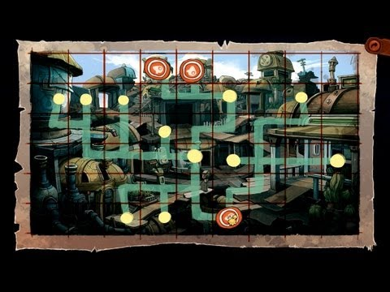

There is a line to meet the mayor.

# Any hints?
Is it your turn already?

# No...
Did you take a number?

# Yes
And offer it to Lotti? You would have to get rid of the line.

# How?
Maybe if you could cause some problem at the waiters' homes they would leave.

# Yes, good idea!
Like, all three homes would be in trouble simultaneously. Little rumble if you know what I mean.

## Who can cause rumble?
Hannek, at the Alley, could cause some turmoil in selected spots.

## How to cause turmoil?
You should mark the detonation spots on the detonation plan with something magnetic and then ring the bell.

# What magnetic I could use on the detonation plan?
You know these magnets on whiteboards that keep the public announcements on place.

## Tell me where to find them
On Town halls? ^[ Get the magnets from the Town hall whiteboard. ]

# I have the magnets
Now, mark the correct places on the detonation plan with the magnets and ring the bell.

# Hints about the correct places?
Well, the guys in line, of course. That's whose houses you wanted to cause the turmoil to.

# But, I don't know where the waiters live!
What's with the hats, by the way? Chat with the guys in line about their hats.

# Any more hints?
He said the _roofer_ has started to make hats. That is weird.

# Well, it is!
Should the _hat match the roof_ then?

## Umm.. don't get it
Place the magnets in the detonation plan to houses (yellow dots) with roofs matching the three guys' hats and ring the bell.

Before you proceed with setting the magnets: **there is a bug in the detonation plan that can screw your game!** Save your game before touching the detonation plan and read more [here](../magnet-bug.md).

## Show me the correct positions for the markers

# I did it!
The line is free!

## But 66 is still too much
Check out the floor. ^[ There is a number 63 on the floor. Pick it up and off to Lotti! ]

# What next?
Wenzel! That sleazeball!

[How to get Wenzel to Mayor's office](wenzel.md)
